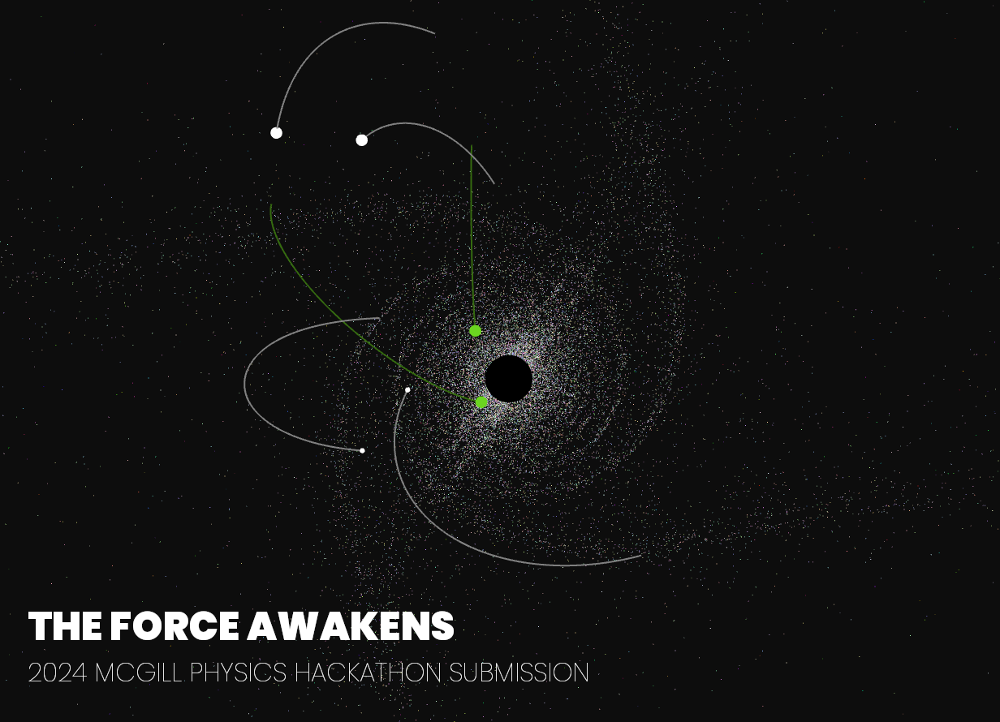
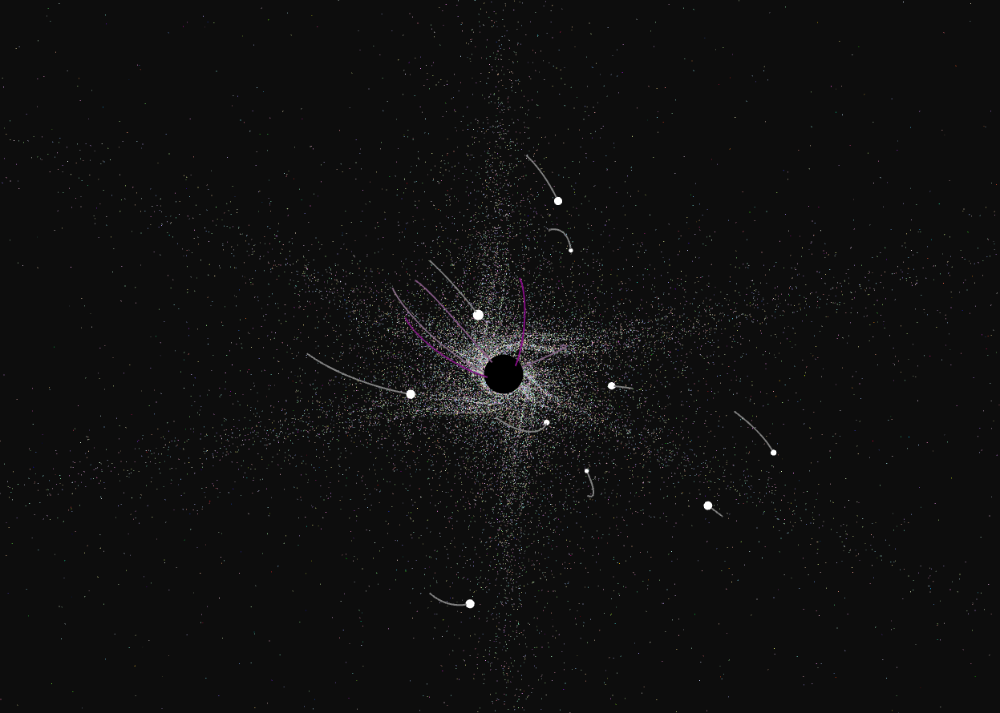
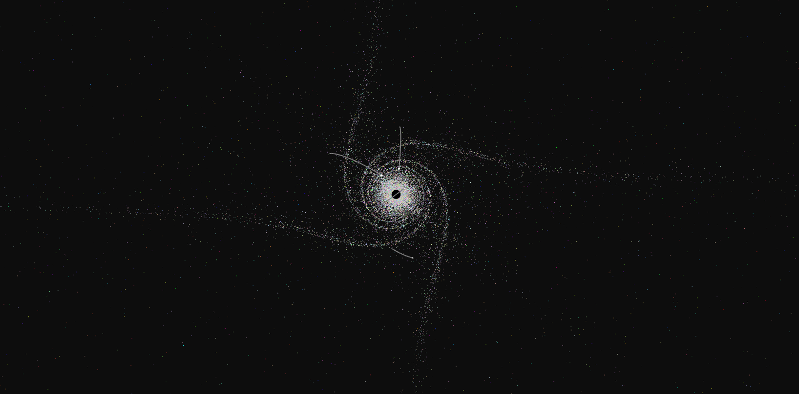
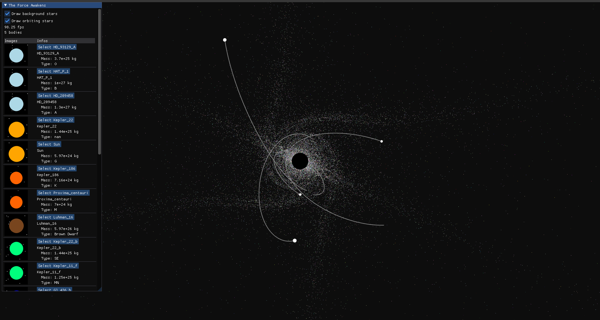
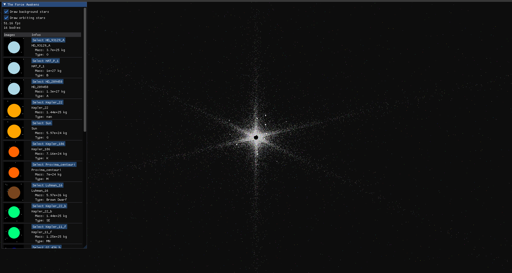
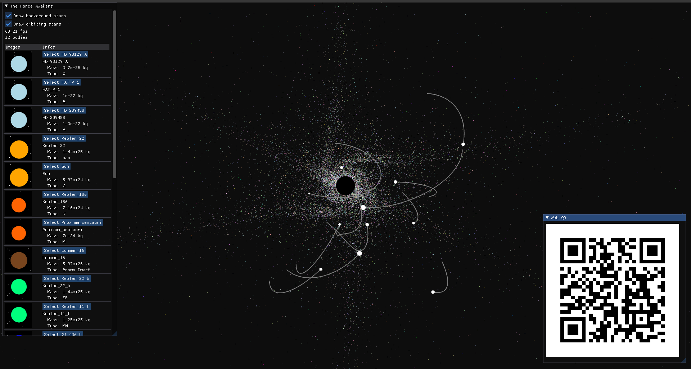
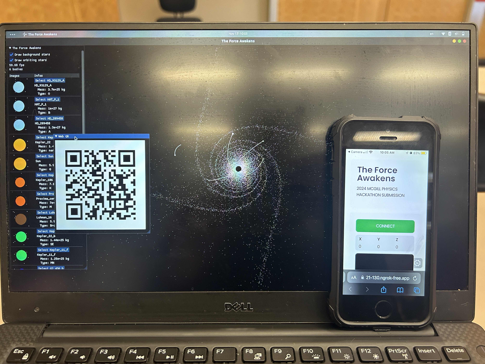

#### Black Hole Orbital Mechanics N-Body Simulator


## Authors

Concretizing the physics formulas we've all seen in class - making them more approachable - by means of interactive visualizations. Simulating orbital mechanics for deep-space navigation and missions.

Tian Yi Xia<sup>1</sup>, Thomas Deleuze-Bisson<sup>1</sup>, Mateo Duque<sup>1</sup></h4>

<sup>1</sup>Dawson College, Montréal


## A Little Bit About Us

Three Dawson College Students in the Enriched Science Program. As we share common passions such as programming, physics, space and math, we've decided to participate in the **2024 Edition of the McGill University Physics Hackathon**. Ever since we had figured out that astrophysics was a field that scared most people because of its complexity, we decided to make it our mission to demonstrate it in the simplest way possible and what better way to do so than to make **an accessible, interactive and adaptable sandbox in which the powers of graviationnal fields, forces and accelerations can be observed - and harnessed**.

## The Idea

- Taking the wonder of space and the beauty of orbital mechanics, to visualize them to the eyes of anyone by implementing a program that **simulates the orbits of celestial bodies around a black hole**.

- **Mass and gravitational pull of the bodies increasing** as it collisions happen between the orbiting bodies, to mirror how that happens in reality.

- Interactive and engaging for users: **a phone website where the user can launch planets with masses and velocities into the system**, so as to continually have more interactions between celestial bodies, the black hole, and each other.

## Project Structure

- `force_awakens/`: Root of Python package
    - `__main__.py`: Entrypoint
    - `app.py`: Rendering loop
    - `graphics/`
        - `draw.py`: Objects and planets drawing
        - `render.py`: OpenGL rendering helper functions
    - `mechanics/`
        - `mechanics.py`: Body adding mechanics
        - `colors.py`: Body colors
        - `elements_in_space.csv`: Body properties
    - `web/`
        - `server.py`: Webserver for client connection and interactivity
        - `index.html`: Client side website
    - `images/`: Resources and loaded textures

## Requirements

The requirements for running the code are as follows:
- Flask==3.1.0
- glfw==2.7.0
- imgui==2.0.0
- matplotlib==3.9.2
- ngrok==1.4.0
- numpy==2.1.3
- pandas==2.2.3
- Pillow==11.0.0
- pygame==2.6.1
- PyOpenGL==3.1.7
- qrcode==8.0

## How it Works

1. **Gather data of various planets and other celestial bodies** across our universe such as exoplanets, stars, etc. using tools such as NASA's Eyes on Exoplanets. 
    - We **obtain an accurate representation** of what each known star and exoplanet looks like which abled us to draw their visual models. For planets from the Star Wars Universe, we looked trough various fan websites, approximations and even quotes from the movie to get their properties.

    - **Organize planet properties** in order to be able to plug them in our actual black hole model.

3. **Simulate body interactions with Newtonian Physics** and Euler Integration over timesteps, for each body pair interaction.
 
    -  We calculate seperatly the gravitational force, and **sum the forces exerted** by the different planets on the desired planet. We repeat this process for every single planet. In other words, we calculate the the sum of forces for every planets by adding all of the Fg that the other planets exert on it.

    - We then find their acceleration with **Newton's Second Law**. Their velocity using the acceleration and finally, their position using this velocity that gets integrated at 60Hz.

4. **Render simulated planets** and stars using OpenGL, with a user interface built in Imgui.

5. A website that is joinable by phone to **interact with the application in real-time**.


## How to Run

Clone repository locally

```bash
git clone https://github.com/ThatAquarel/force_awakens.git
cd force_awakens/
```

Install Python dependencies with python>=3.11
```bash
pip install -r requirements.txt
```

Install package locally in development mode
```bash
pip install -e .
```

Run program (different command line options)
```bash
python -m force_awakens          # Run simulation
python -m force_awakens --web    # Run simulation with web client, needs NGROK_AUTHTOKEN set as env variable

python -m force_awakens --web --port 5000                # Specify port
python -m force_awakens --web --token $NGROK_AUTHTOKEN$  # Specify token
python -m force_awakens --web --no-tunnel                # Run locally on 127.0.0.1
```

## Results

### Orbital Simulation Rendering



### Software Interface



# Phone Website and Client Interaction



## Contacts

- [Tian Yi, Xia](https://github.com/ThatAquarel), xtxiatianyi@gmail.com: 
- [Thomas, Deleuze-Bisson](https://github.com/Thomas4534), deleuzethomasbisson@gmail.com: 
- [Evan Parasol](https://github.com/TheBookwyrms), blackdragon6493@gmail.com: 

## References

1. Rohlfs, M., & Pohl, T. (2009). Quantum dots in semiconductor nanostructures: From basic physics to quantum technologies. Proceedings of the National Academy of Sciences, 106(47), 20129-20134. https://doi.org/10.1073/pnas.0910927107
2. Kisa, M. (n.d.). Rotations and rotation matrices. Retrieved from http://pajarito.materials.cmu.edu/documents/Kisa.Papers/Rotations%20and%20rotation%20matrices.pdf
3. X-Engineer. (n.d.). Euler integration. X-Engineer. Retrieved November 16, 2024, from https://x-engineer.org/euler-integration/
4. Takahashi, R., & Uchida, H. (2016). Relativistic MHD simulations of black hole systems. Physics of Fluids, 28(11), 110701. https://doi.org/10.1063/1.4964783
5. Zhang, L., & Wu, H. (2023). "Research on Enhanced Orbit Prediction Techniques Utilizing Multiple Sets of Two-Line Element (TLE)." Journal of Spacecraft and Rockets, 60(5), 1181-1196. DOI: 10.2514/1.A34658
6. National Oceanic and Atmospheric Administration (NOAA) and Joint Center for Satellite Data Assimilation (JCSDA). "Orbit Simulator for Satellite and Near-Space Platforms." NOAA Technical Report, 2021. DOI: 10.1016/j.ejpra.2020.100054
7. NASA Jet Propulsion Laboratory. (2020). Eyes on Exoplanets. NASA. Retrieved November 16, 2024, from https://eyes.nasa.gov

